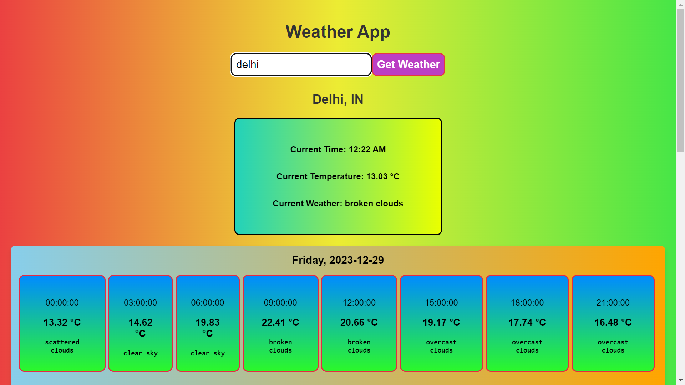

# Weather App

A simple React-based weather application that allows users to check the current weather and forecast for a given city.

## Table of Contents
- [Overview](#overview)
- [Features](#features)
- [How to Use](#how-to-use)
- [Installation](#installation)
- [Screenshots](#screenshots)

## Overview

The Weather App is a React application that fetches weather data from the OpenWeatherMap API. Users can enter the name of a city, click a button, and receive information about the current weather and a 5-day forecast.

## Features

- Current temperature display
- Current weather description
- 5-day weather forecast with time slots
- Clickable time slots for detailed information
- Automatic data reload every minute

## How to Use

1. Enter the name of the city in the input field.
2. Click the "Get Weather" button or press Enter.
3. View the current weather information and 5-day forecast.
4. Click on time slots to see detailed information.

## Installation

1. Clone the repository.
2. Install dependencies using `npm install`.
3. Replace the placeholder API key in the `WeatherApp.js` file with your own OpenWeatherMap API key. You can obtain a key by signing up on the [OpenWeatherMap website](https://openweathermap.org/api).
4. Run the application with `npm start`.

## Screenshots

